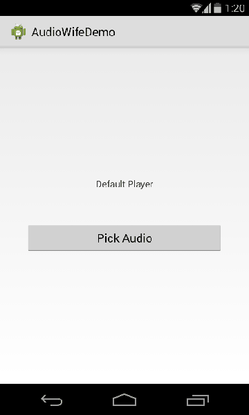

Index
==================

* [Introduction](https://github.com/jaydeepw/audio-wife#audio-wife---introduction)

* [Why this project?](https://github.com/jaydeepw/audio-wife#why-this-project)

* [Including in your own project](https://github.com/jaydeepw/audio-wife#including-in-your-project)

* [Getting started](https://github.com/jaydeepw/audio-wife#getting-started)

* [Add custom listeners](https://github.com/jaydeepw/audio-wife#add-custom-listeners)

* [Why the name 'AudioWife'?](https://github.com/jaydeepw/audio-wife#why-the-name-audiowife)

* [Contributing](https://github.com/jaydeepw/audio-wife#contributing)

* [Developed by](https://github.com/jaydeepw/audio-wife#developed-by)

* [Credits](https://github.com/jaydeepw/audio-wife#credits)

* [License](https://github.com/jaydeepw/audio-wife#license)


Audio Wife - Introduction
==========

A simple themable & integrable audio player library for Android. Helps you have an Audio Controller
for your Audio Player UI. Have your own UI and pass the instance of UI controls like
Play button, Pause button, Seekbar etc to AudioWife and rest is taken care of.

your_player.xml


Demo
==========



Caution!
==========
Eclipse library project structure has been dropped. If you wish to use this library in your eclipse IDE, please checkout [eclipse-develop][3].
No further development will be done or merged into [eclipse-develop][3] branch.


Why this project?
====================
1. A simple native audio player API wrapper
2. Others found were complex & provided no way to be integrate as library
3. Some even involved compilation using Android NDK


Features
=========
1. Provides default UI truly making it an integrable player.
2. Ability to set multiple custom click handlers to play and pause buttons.
3. No dependencies.


Including in your project
=========================

AudioWife is presented as an [Android library project][1].

You can include this project by [referencing it as a library project][2] in
Eclipse or ant.

This project has NO DEPENDENCIES.


Download
--------
Gradle:
```groovy

{
	compile 'net.the4thdimension:audio-wife:1.0.3'
}

```
Requires Android 4.0+.

Getting started
====================

Permission required to play audio

```xml
<uses-permission android:name="android.permission.WRITE_EXTERNAL_STORAGE" />
```


##Using default player UI

AudioWife comes with a simple default player UI that you can use right away.
This is the simplest and fastest way to get AudioWife working.

```java
// mPlayerContainer = Parent view to add default player UI to.
AudioWife.getInstance().init(mContext, uri)
		.useDefaultUi(mPlayerContainer, getLayoutInflater());

```

##Using custom player UI

You can initialize the custom player controls of your UI using AudioWife

```java

// initialize the player controls
mPlayMedia = findViewById(R.id.play);
mPauseMedia = findViewById(R.id.pause);
mMediaSeekBar = (SeekBar) findViewById(R.id.media_seekbar);
mRunTime = (TextView) findViewById(R.id.run_time);
mTotalTime = (TextView) findViewById(R.id.total_time);

// AudioWife takes care of click handler for play/pause button
AudioWife.getInstance()
		 .init(mContext, uri)
		 .setPlayView(mPlayMedia)
		 .setPauseView(mPauseMedia)
		 .setSeekBar(mMediaSeekBar)
		 .setRuntimeView(mRunTime)
		 .setTotalTimeView(mTotalTime);

// to explicitly pause
AudioWife.getInstance().pause();


// when done playing, release the resources
AudioWife.getInstance().release();

```

##Add custom listeners

To extend the capabilities of AudioWife, custom click listeners can be attached.
Refer to source documentation for more details.

```java

AudioWife.getInstance().addOnCompletionListener( new MediaPlayer.OnCompletionListener() {
	
	@Override
	public void onCompletion(MediaPlayer mp) {
		Toast.makeText(getBaseContext(), "Completed", Toast.LENGTH_SHORT)
			 .show();
		// do you stuff
	}
});

AudioWife.getInstance().addOnPlayClickListener(new View.OnClickListener() {
	
	@Override
	public void onClick(View v) {
		Toast.makeText(getBaseContext(), "Play", Toast.LENGTH_SHORT)
			 .show();
		// Lights-Camera-Action. Lets dance.
	}
});

AudioWife.getInstance().addOnPauseClickListener(new View.OnClickListener() {
	
	@Override
	public void onClick(View v) {
		Toast.makeText(getBaseContext(), "Pause", Toast.LENGTH_SHORT)
			 .show();
		// Your on audio pause stuff.
	}
});
```

Why the name 'AudioWife'?
=========================
This relates with another Android AudioRecorder library project that is coming soon. 
The name AudioWife comes from an analogy of a married couple where the wife is an active Player, hence AudioWife
for Audio Player and husband being a Listener hence AudioHusband for Audio Recorder.

Later found that Audio Recorder Library project already exists for Android.
You can find it [here](https://github.com/steelkiwi/AndroidRecording).

Contributing
=========================

Please fork this repository and contribute back using
[pull requests](https://github.com/jaydeepw/audio-wife/pulls).

Please follow Android coding [style guide](https://source.android.com/source/code-style.html)


Developed by
============

 * Jaydeep Wagh - <jaydeep.w@gmail.com>
 * Twitter - [Jaydeep_W](https://twitter.com/Jaydeep_W)

Credits
==========

[Official Android MediaPlayer Dev Docs](http://developer.android.com/reference/android/media/MediaPlayer.html)

[Android MediaPlayer Tutorial](http://www.tutorialspoint.com/android/android_mediaplayer.htm)


License
=======

	The MIT License (MIT)

	Copyright (c) 2014 Jaydeep

	Permission is hereby granted, free of charge, to any person obtaining a copy
	of this software and associated documentation files (the "Software"), to deal
	in the Software without restriction, including without limitation the rights
	to use, copy, modify, merge, publish, distribute, sublicense, and/or sell
	copies of the Software, and to permit persons to whom the Software is
	furnished to do so, subject to the following conditions:

	The above copyright notice and this permission notice shall be included in all
	copies or substantial portions of the Software.

	THE SOFTWARE IS PROVIDED "AS IS", WITHOUT WARRANTY OF ANY KIND, EXPRESS OR
	IMPLIED, INCLUDING BUT NOT LIMITED TO THE WARRANTIES OF MERCHANTABILITY,
	FITNESS FOR A PARTICULAR PURPOSE AND NONINFRINGEMENT. IN NO EVENT SHALL THE
	AUTHORS OR COPYRIGHT HOLDERS BE LIABLE FOR ANY CLAIM, DAMAGES OR OTHER
	LIABILITY, WHETHER IN AN ACTION OF CONTRACT, TORT OR OTHERWISE, ARISING FROM,
	OUT OF OR IN CONNECTION WITH THE SOFTWARE OR THE USE OR OTHER DEALINGS IN THE
	SOFTWARE.


[1]: http://developer.android.com/guide/developing/projects/projects-eclipse.html
[2]: http://developer.android.com/guide/developing/projects/projects-eclipse.html#ReferencingLibraryProject
[3]: https://github.com/jaydeepw/audio-wife/tree/eclipse-develop
